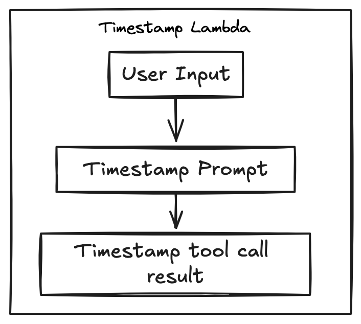

# Magic Chat Prototype

## Prerequisites

Before you begin, ensure you have the following:

- **Node.js**: Install the latest stable version of Node.js from [nodejs.org](https://nodejs.org/).
- **Magic Account**: Sign up at [Magic](https://magic.link/) for authentication and wallet services. You'll need access to their TEE service enabled for your Magic app.
- **OpenAI API Key**: Get an API key from [OpenAI](https://platform.openai.com/signup/).
- **Alchemy Account**: Sign up for [Alchemy](https://www.alchemy.com/). It is used as an RPC service.
- **Vercel Account**: Set up KV Storage on Vercel [Vercel](https://vercel.com/docs/storage/vercel-kv). You can also use it for deploying your project.
- **Etherscan/PolygonScan Accounts**: Sign up on [Etherscan](https://etherscan.io/) and [PolygonScan](https://polygonscan.com/) if you want to use their APIs for contract verification.

## Quickstart

### 1. Clone the Repository

```bash
git clone <repo-url>
cd <repo-folder>
```

### 2. Install Dependencies

```bash
npm install
```

### 3. Configure Environment Variables

You'll need to set up various API keys and configuration settings. Copy the `.env.example` file as `.env` and update it as necessary with the values from your various accounts.

- **Magic API**: Create an app on [Magic](https://magic.link/) and copy your **public** and **secret** API keys. Make sure your Magic app has TEE (Trusted Execution Environment) enabled.
- **OpenAI API**: Get your API key for [OpenAI](https://platform.openai.com/).
- **Alchemy API**: Create an app on Alchemy and obtain your API key. Follow the [Alchemy documentation](https://docs.alchemy.com/alchemy/) for more details.
- **Vercel KV Store**: Copy your [Vercel KV](https://vercel.com/docs/storage/vercel-kv) environment variables into your `.env`
- **Etherscan/PolygonScan API**: Optionally, create accounts on [Etherscan](https://etherscan.io/register) or [PolygonScan](https://polygonscan.com/register) and add their respective API keys.

### 4. Run the Project

To start the development server:

```bash
npm run dev
```

The app should now be running on `http://localhost:3000`.

### 5. Set Up Your Magic TEE Wallet

1. **Login to your Magic account** via the UI.
2. **Set up a PIN** for your TEE wallet. This will be used for signing transactions securely.
3. **Transfer funds** You'll need some tokens in your wallet to pay for gas fees. You can use a faucet like [Chainlink](https://faucets.chain.link/sepolia) if you need some testnet tokens.

### 6. Upload a Contract

- You can upload contracts using your Magic TEE wallet. For example, you can start by uploading a **Uniswap contract** on the Sepolia testnet.

  Example Uniswap contract address on Sepolia:

  ```
  0xC532a74256D3Db42D0Bf7a0400fEFDbad7694008
  ```

### 7. Execute Queries

- **Wallet Address**: Your TEE wallet address will be visible in the bottom-left corner of the interface. Click the address to copy it.
- **Ask Queries**: Try asking questions like "Can you swap ETH for USDC?" in the app's interface.
- **Execute Functions**: Refine your query to a specific function execution. Click "Execute" and enter your PIN to proceed.

### 8. Check Transaction Status

If the execution is successful, you will receive a link to the transaction on the blockchain (e.g., Etherscan). If not, check the following:

- Ensure you have a valid wallet PIN.
- Verify that you have sufficient funds for gas fees.
- Check if the contract is correctly uploaded and the address is valid.

## Known Issues

- **Inline Toolcalls**:
- **Hallucinate Values**:
  - LLaMA 3.1 is more likely to respond with tool calls earlier than OpenAI and can hallucinate arguments in tool calls. It can be nudged with more conversation.
- **Ambiguous Tool Calls**:
  - Even with multi-agent filtering, it's possible to have too many or ambiguous tool calls based on the number of uploaded and enabled contracts.
- **Contract Functions with ETH**:
  - If you upload a contract with functions that require a non-zero amount of ETH in the transaction, you'll need to manually add those function descriptions after upload.
- **Token Calculation Error**:
  - You may encounter the error:
    ```
    Failed to calculate number of tokens, falling back to approximate count
    Error: Unknown model
    ```
  - This occurs when using ChatTogetherAI and ChatFireworks with LangChain's OpenAI interface, which relies on `js-tiktoken`. This package only handles OpenAI model names [hardcoded in the source](https://github.com/langchain-ai/langchainjs/blob/747f324d20a5fe7f4a282b184d63919e8e95e00a/langchain-core/src/language_models/base.ts).

## Repo structure

- TODO

## Customization

#### This project supports LLM inference through Ollama, Together.ai, and Fireworks.ai.

- To add other LLMs, edit `MODELS` inside `constants/index.ts` and add the model to its respective inference provider.

- **Ollama**: No special configuration is required. Ensure Ollama is installed and running locally, and add the model name to `constants/index.ts`.

- **Together.ai**: Create an account at Together.ai, retrieve your API key from the [dashboard](https://api.together.ai/settings/api-keys), and add it to your `.env` as `{TOGETHER_AI_API_KEY}`.

- **Fireworks.ai**: Sign up at Fireworks.ai, create an API key in the [dashboard](https://fireworks.ai/account/api-keys), and add it to your `.env` as `{FIREWORKS_API_KEY}`.

#### Predefined chat messages

- The SuggestedMessageList component allows you to add an array of suggested messages, to quickly provide predefined options for user interaction. These messages can be tailored to specific use cases, such as contract functions or common queries. If you need different default options, simply modify the buttonMessages array in the component.
- Alternatively, the predefined options can be dynamically generated based on the application's context, such as user inputs or available smart contracts, making the component adaptable to various scenarios by passing the array of suggested Message to the component via its props.

#### Walk through how to edit contracts, how context works, how modifying function/ function input descriptions works

#### Walk through how to disable/enable contracts locally

## Prompt Control Flow

### Multi Agent functionality

Given the limitation on the number of tools that can be bound to LLMs for an invocation (refer to your LLM for specific limits), the app includes a filtering mechanism that narrows down available smart contract functions based on conversation context.

#### How It Works:

1. **Conversation Context**:  
   As the user interact with the chat, their inputs are analyzed to understand their intent and the type of smart contract interactions they require (e.g., token transfers, swaps, etc.) if any.

2. **Initial Prompt Filtering**:  
   The app calls a "reasoning prompt". The LLM will understand the intent of the chat with the function sigantures as part of its plain text prompt. This LLM invocation will return a structured response that is used filter the list of available smart contract functions. This filter is based on the context of the user’s ongoing conversation, ensuring that only relevant tools (contract functions) are returned.

3. **Reducing Tool Calls**:  
    By filtering the available tools, the LLM is more focused on the appropriate smart contract interactions, minimizing the risk of errors or hallucinations. This ensures that the LLM can efficiently respond to the user's requests within the limits of its tool-calling capabilities.
   

#### Lambda timestamp functionality

LangChain’s architecture enables flexible integration between language models (LLMs), prompts, and external tools, making it well-suited for dynamic workflows like generating timestamps. In scenarios where smart contract functions require precise timestamps, LLMs can struggle to produce accurate results on their own.

The **timestamp lambda** approach provides a reliable solution by handling the natural language input through the following process:

1. **User Input & Reasoning**: The LLM receives natural language input (e.g., "5 hours from now") and reasons about the relative time.
2. **Tool Call**: Instead of guessing the timestamp, the LLM generates a tool call that contains the time difference in seconds.
3. **Timestamp Tool**: The invoked tool calculates the exact Unix timestamp based on the provided seconds.
4. **Injecting Result**: This timestamp is injected back into the LLM's reasoning process to complete the prompt or interaction.



## Deployment

- Is built to be deployable on vercel, but should be able to deploy elsewhere (link to next documentation)

## Dependencies

### Important Libraries

Refer to documentation for the follow libraries for additional functionality

- [Vercel/ai](https://sdk.vercel.ai/)
- [Langchain JS](https://js.langchain.com/docs/introduction/)
- [Shadcn/UI](https://ui.shadcn.com/docs/components)
- [Magic SDK](https://magic.link/docs/api/client-side-sdks/web)
- [Ethers](https://docs.ethers.org/v6/)
